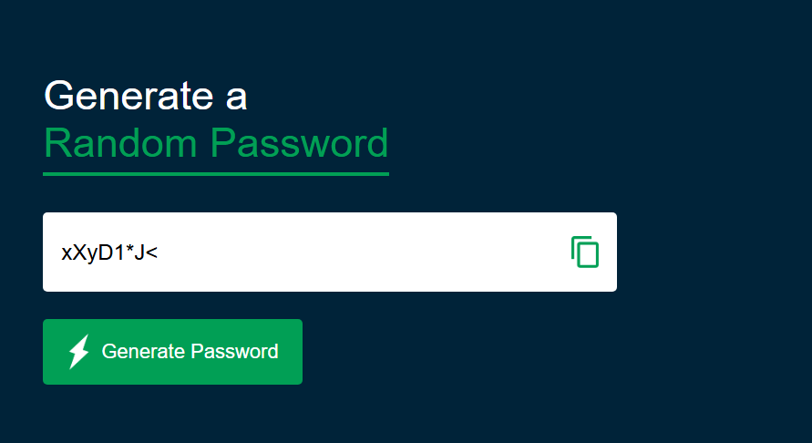
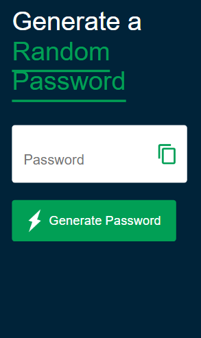

### Random Password Generate

🔐 Random Password Generator
A simple and responsive web application built with HTML, CSS, and JavaScript that generates a random 12-character password. With just a click, you can generate a strong password and copy it to your clipboard instantly for use anywhere.

🚀 ## Features
🔄 Generates a random password every time.

🔒 Password length is 12 characters by default.

📋 Copy to clipboard functionality.

💻 Clean, responsive, and user-friendly interface.

📸 Screenshot
  Desktop-View
  

  Mobile-view
  

🛠️ Technologies Used
HTML

CSS

JavaScript

🧠 How It Works
Click the "Generate Password" button.

A new random password is displayed.

Click the "Copy" button to copy it to your clipboard.

Paste and use your password wherever you need.

✅ How to Use
Clone the repository or download the ZIP.

Open index.html in your browser.

Click the button to generate a password.

Copy and use your new secure password!

📌 Note
The password is randomly generated using JavaScript's Math.random() method.

You can customize the length or character set in the JavaScript file (script.js) if needed.
